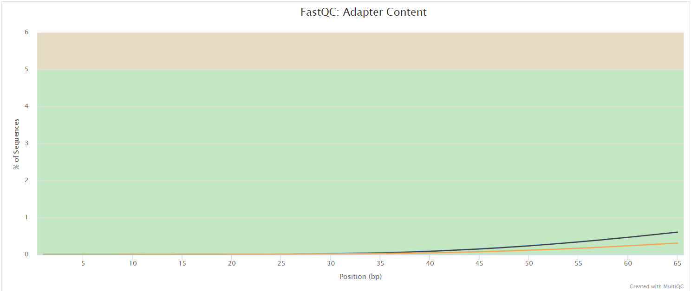

# User Guide

## Table of Contents

- [Getting Started](#getting-started)
- [Preparing Files](#preparing-files)
- [Running the Pipeline](#running-the-pipeline)
- [Test Data](#test-data)
- [Interpreting Output](#interpreting-output)
- [Advanced Configuration and Optimization](#advanced-configuration-and-optimization)

## Getting Started

To use the FoodNet enhanced model pipeline, you will need:

- **R (version 4.3.2)** with the `brms` and `tidybayes` packages.
- **Nextflow (version 24.04.2)** for running the pipeline.
- Access to the **FoodNet surveillance dataset**.

For a detailed list of software and dependencies, please refer to the [GitHub repository](https://github.com/CDCgov/FoodNetTrends).

We highly recommend the use of Docker or Singularity containers for full pipeline reproducibility. If these are not possible, Conda is also supported. See the [Profiles](#-profile) section for more information.

## Preparing Files

Data preparation is crucial for accurate modeling. The FoodNetTrends is designed for the following:

- **Site-level data aggregated annually**.
- Data formatted for Bayesian analysis using the `brms` package.
- **Metadata** regarding county-year levels for accurate site identification.

Ensure that data files follow the specified format below to prevent errors during pipeline execution.

### Samplesheet Input

Before running the pipeline, create a **samplesheet** with information about the samples you would like to analyze. Use the `--input` parameter to specify its location. The samplesheet must be a comma-separated file (CSV) with **three columns** and a header row, as shown in the examples below.

```bash
--input '[path to samplesheet file]'
```

#### Multiple Runs of the Same Sample

If you have re-sequenced the same sample more than once (e.g., to increase sequencing depth), the `sample` identifiers should be the same. The pipeline will concatenate the raw reads before performing any downstream analysis. Below is an example for the same sample sequenced across three lanes:

```csv
sample,fastq_1,fastq_2
CONTROL_REP1,AEG588A1_S1_L002_R1_001.fastq.gz,AEG588A1_S1_L002_R2_001.fastq.gz
CONTROL_REP1,AEG588A1_S1_L003_R1_001.fastq.gz,AEG588A1_S1_L003_R2_001.fastq.gz
CONTROL_REP1,AEG588A1_S1_L004_R1_001.fastq.gz,AEG588A1_S1_L004_R2_001.fastq.gz
```

#### Full Samplesheet

The pipeline will auto-detect whether a sample is single- or paired-end based on the information provided in the samplesheet. The samplesheet can have additional columns if needed; however, the **first three columns** must match those defined below.

An example samplesheet file consisting of both single- and paired-end data may look like this. This example includes six samples, where `TREATMENT_REP3` has been sequenced twice:

```csv
sample,fastq_1,fastq_2
CONTROL_REP1,AEG588A1_S1_L002_R1_001.fastq.gz,AEG588A1_S1_L002_R2_001.fastq.gz
CONTROL_REP2,AEG588A2_S2_L002_R1_001.fastq.gz,AEG588A2_S2_L002_R2_001.fastq.gz
CONTROL_REP3,AEG588A3_S3_L002_R1_001.fastq.gz,AEG588A3_S3_L002_R2_001.fastq.gz
TREATMENT_REP1,AEG588A4_S4_L003_R1_001.fastq.gz,
TREATMENT_REP2,AEG588A5_S5_L003_R1_001.fastq.gz,
TREATMENT_REP3,AEG588A6_S6_L003_R1_001.fastq.gz,
TREATMENT_REP3,AEG588A6_S6_L004_R1_001.fastq.gz,
```

| Column    | Description                                                                                                                                                                            |
|-----------|----------------------------------------------------------------------------------------------------------------------------------------------------------------------------------------|
| `sample`  | Custom sample name. This entry will be identical for multiple sequencing libraries/runs from the same sample. Spaces in sample names are automatically converted to underscores (`_`). |
| `fastq_1` | Full path to FastQ file for Illumina short reads 1. The file must be gzipped and have the extension `.fastq.gz` or `.fq.gz`.                                                           |
| `fastq_2` | Full path to FastQ file for Illumina short reads 2. The file must be gzipped and have the extension `.fastq.gz` or `.fq.gz`.                                                           |

An [example samplesheet](../assets/samplesheet.csv) has been provided with the pipeline.

### Important Notes

- Ensure that your data files are properly formatted and placed in the correct directories as specified.
- The pipeline expects data in specific formats for successful execution.
- For detailed data formatting guidelines, please consult the [GitHub repository](https://github.com/CDCgov/FoodNetTrends).

## Running the Pipeline

The enhanced FoodNet model is implemented using Nextflow. To run the pipeline:

### Clone the Repository

First, clone the repository from GitHub:

```bash
git clone https://github.com/CDCgov/FoodNetTrends
cd FoodNetTrends
```

### Execute the Pipeline

Execute the pipeline using the following command:

```bash
nextflow run main.nf --input ./samplesheet.csv --outdir ./results -profile docker
```

This command launches the pipeline with the `docker` configuration profile. See the [Profiles](#-profile) section below for more information about profiles.

The pipeline will create the following files and directories in your working directory:

```bash
work             # Directory containing the Nextflow working files
results          # Finished results in specified location (defined with --outdir)
.nextflow_log    # Log file from Nextflow
# Other Nextflow hidden files, e.g., history of pipeline runs and old logs.
```

### Using a Parameters File

If you wish to repeatedly use the same parameters for multiple runs, specify them in a parameters file.

Pipeline settings can be provided in a `yaml` or `json` file via the `-params-file <file>` option.

For example:

```bash
nextflow run main.nf -profile docker -params-file params.yaml
```

With `params.yaml` containing:

```yaml
input: './samplesheet.csv'
outdir: './results/'
# Add other parameters as needed
```

You can also generate such `YAML`/`JSON` files via [nf-core/launch](https://nf-co.re/launch).

#### Warning

Do not use `-c <file>` to specify pipeline parameters, as this will result in errors. Custom config files specified with `-c` must only be used for [tuning process resource specifications](#resource-requests), infrastructural tweaks (such as output directories), or module arguments (args).

## Test Data

A set of test data is included to validate your setup:

- Download the test data from [here](https://github.com/CDCgov/FoodNetTrends/test_data).

You can also use the `test` profile to run the pipeline with test data:

```bash
nextflow run main.nf -profile test,docker
```

This profile includes links to test data and uses the Docker profile for containerization. It's useful for testing your setup before running the pipeline on your own data.

**Note:** The order of profiles matters; they are loaded in sequence, so later profiles can overwrite earlier profiles.

## Interpreting Output

After the pipeline completes, you'll find several files and directories in your output folder (`./results` or the specified `--outdir`). These include:

- **Plots and Figures**: Visualizations of the trends and model comparisons.
- **Summary Statistics**: Tabulated results of the analyses.
- **Logs**: Detailed logs of the pipeline execution for troubleshooting.

The pipeline processes data using the following steps:

- **FastQC** - Raw read quality control.
- **MultiQC** - Aggregates reports and QC metrics from the entire pipeline.
- **Pipeline Information** - Provides metrics generated during the workflow execution.

### FastQC

**Output files:**

- `fastqc/`
  - `*_fastqc.html`: FastQC report containing quality metrics.
  - `*_fastqc.zip`: Zip archive containing the FastQC report, tab-delimited data files, and plot images.

[FastQC](http://www.bioinformatics.babraham.ac.uk/projects/fastqc/) provides general quality metrics about your sequenced reads. It offers information about the quality score distribution across your reads, per base sequence content (%A/T/G/C), adapter contamination, and overrepresented sequences. For further reading and documentation, see the [FastQC help pages](http://www.bioinformatics.babraham.ac.uk/projects/fastqc/Help/).




> **Note:** The FastQC plots displayed in the MultiQC report show _untrimmed_ reads. They may contain adapter sequences and potentially regions with low quality.

### MultiQC

**Output files:**

- `multiqc/`
  - `multiqc_report.html`: A standalone HTML file that can be viewed in your web browser.
  - `multiqc_data/`: Directory containing parsed statistics from the different tools used in the pipeline.
  - `multiqc_plots/`: Directory containing static images from the report in various formats.

[MultiQC](http://multiqc.info) is a visualization tool that generates a single HTML report summarizing all samples in your project. Most of the pipeline QC results are visualized in the report, and further statistics are available in the report data directory.

Results generated by MultiQC collate pipeline QC from supported tools, such as FastQC. The pipeline includes steps to report software versions in the MultiQC output for future traceability. For more information about how to use MultiQC reports, see the [MultiQC documentation](http://multiqc.info).

### Pipeline Information

**Output files:**

- `pipeline_info/`
  - Reports generated by Nextflow: `execution_report.html`, `execution_timeline.html`, `execution_trace.txt`, and `pipeline_dag.dot`/`pipeline_dag.svg`.
  - Reports generated by the pipeline: `pipeline_report.html`, `pipeline_report.txt`, and `software_versions.yml`. The `pipeline_report*` files will only be present if the `--email` or `--email_on_fail` parameters are used when running the pipeline.
  - Reformatted samplesheet files used as input to the pipeline: `samplesheet.valid.csv`.
  - Parameters used by the pipeline run: `params.json`.

[Nextflow](https://www.nextflow.io/docs/latest/tracing.html) provides functionality for generating various reports relevant to the execution of the pipeline. These reports help troubleshoot errors and provide information such as launch commands, run times, and resource usage.

## Advanced Configuration and Optimization

### Core Nextflow Arguments

#### `-profile`

Use this parameter to choose a configuration profile. Profiles provide configuration presets for different compute environments.

Several generic profiles are bundled with the pipeline, instructing it to use software packaged using different methods (Docker, Singularity, Podman, Shifter, Charliecloud, Apptainer, Conda).

**Available Profiles:**

- `test`
  - A profile with a complete configuration for automated testing.
  - Includes links to test data so needs no other parameters.
- `docker`
  - A generic configuration profile to be used with [Docker](https://docker.com/).
- `singularity`
  - A generic configuration profile to be used with [Singularity](https://sylabs.io/docs/).
- `podman`
  - A generic configuration profile to be used with [Podman](https://podman.io/).
- `shifter`
  - A generic configuration profile to be used with [Shifter](https://nersc.gitlab.io/development/shifter/how-to-use/).
- `charliecloud`
  - A generic configuration profile to be used with [Charliecloud](https://hpc.github.io/charliecloud/).
- `apptainer`
  - A generic configuration profile to be used with [Apptainer](https://apptainer.org/).
- `conda`
  - A generic configuration profile to be used with [Conda](https://conda.io/docs/). Please use Conda as a last resort when it's not possible to run the pipeline with other container technologies.

**Note:**

- We highly recommend the use of Docker or Singularity containers for full pipeline reproducibility. However, when this is not possible, Conda is also supported.
- Multiple profiles can be loaded, for example: `-profile test,docker`. The order of arguments is important as they are loaded in sequence; later profiles can overwrite earlier profiles.
- If `-profile` is not specified, the pipeline will run locally and expect all software to be installed and available on the `PATH`. This is **not** recommended, as it can lead to different results on different machines depending on the computing environment.

#### `-resume`

Use this option when restarting a pipeline. Nextflow will use cached results from any pipeline steps where the inputs are the same, continuing from where it left off previously. For inputs to be considered the same, not only the names must be identical but the files' contents as well. For more information about this parameter, see [this blog post](https://www.nextflow.io/blog/2019/demystifying-nextflow-resume.html).

You can also supply a run name to resume a specific run:

```bash
nextflow run main.nf -resume [run-name]
```

Use the `nextflow log` command to show previous run names.

#### `-c`

Specify the path to a specific config file (this is a core Nextflow command). See the [nf-core website documentation](https://nf-co.re/usage/configuration) for more information.

**Warning:** Do not use `-c <file>` to specify pipeline parameters, as this will result in errors. Custom config files specified with `-c` must only be used for tuning process resource specifications, infrastructural tweaks (such as output directories), or module arguments (args).

### Custom Configuration

#### Resource Requests

You may want to customize the compute resources that the pipeline requests. Each step in the pipeline has default requirements for the number of CPUs, memory, and time. For most steps, if the job exits with any of the error codes specified [here](https://github.com/nf-core/rnaseq/blob/master/conf/base.config#L18), it will automatically be resubmitted with higher requests (twice the original, then three times). If it still fails after the third attempt, the pipeline execution stops.

To change the resource requests, please see the [max resources](https://nf-co.re/docs/usage/configuration#max-resources) and [tuning workflow resources](https://nf-co.re/docs/usage/configuration#tuning-workflow-resources) sections of the nf-core website.

#### Custom Containers

In some cases, you may wish to change which container or Conda environment a step of the pipeline uses for a particular tool. By default, nf-core pipelines use containers and software from the [BioContainers](https://biocontainers.pro/) or [Bioconda](https://bioconda.github.io/) projects. However, the pipeline-specified version may be out of date.

To use a different container from the default or a different Conda environment specified in a pipeline, please see the [updating tool versions](https://nf-co.re/docs/usage/configuration#updating-tool-versions) section of the nf-core website.

#### Custom Tool Arguments

A pipeline might not always support every possible argument or option of a particular tool used in the pipeline. Fortunately, nf-core pipelines provide flexibility for users to insert additional parameters that the pipeline does not include by default.

To learn how to provide additional arguments to a particular tool in the pipeline, please see the [customizing tool arguments](https://nf-co.re/docs/usage/configuration#customising-tool-arguments) section of the nf-core website.

#### nf-core/configs

If you and others within your organization are likely to run nf-core pipelines regularly and need to use the same settings, consider requesting that your custom config file be uploaded to the `nf-core/configs` Git repository.

See the main [Nextflow documentation](https://www.nextflow.io/docs/latest/config.html) for more information about creating your own configuration files.

If you have any questions or issues, please send a message on [Slack](https://nf-co.re/join/slack) in the [`#configs` channel](https://nfcore.slack.com/channels/configs).

### Azure Resource Requests

To be used with the `azurebatch` profile by specifying the `-profile azurebatch`.

We recommend providing a compute `params.vm_type` of `Standard_D16_v3` VMs by default, but these options can be changed if required.

Note that the choice of VM size depends on your quota and the overall workload during the analysis. For a thorough list, please refer to the [Azure Sizes for virtual machines in Azure](https://docs.microsoft.com/en-us/azure/virtual-machines/sizes).

### Running in the Background

Nextflow handles job submissions and supervises the running jobs. The Nextflow process must run until the pipeline is finished.

The Nextflow `-bg` flag launches Nextflow in the background, detached from your terminal so that the workflow does not stop if you log out of your session. The logs are saved to a file.

Alternatively, you can use `screen`, `tmux`, or similar tools to create a detached session that you can log back into later. Some HPC setups also allow you to run Nextflow within a cluster job submitted to your job scheduler (from where it submits more jobs).

### Nextflow Memory Requirements

In some cases, the Nextflow Java virtual machine can start to request a large amount of memory. It's recommended to add the following line to your environment to limit this (typically in `~/.bashrc` or `~/.bash_profile`):

```bash
export NXF_OPTS='-Xms1g -Xmx4g'
```

---
For additional documentation and support, please refer to the [GitHub repository](https://github.com/CDCgov/FoodNetTrends).
